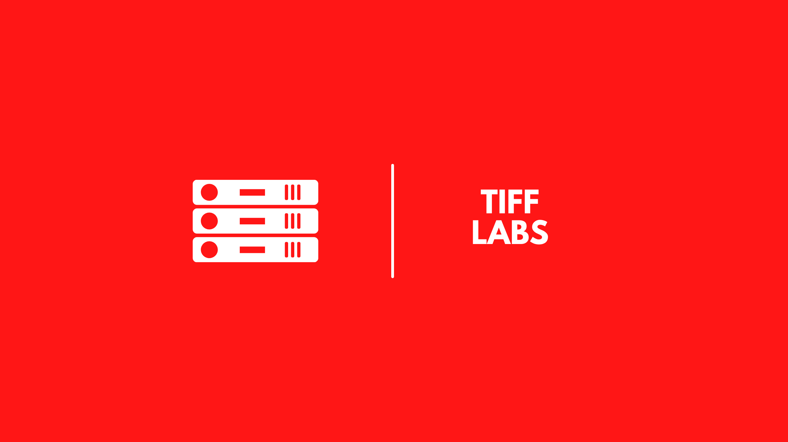

  

<h1 align="center">Tiff Labs  Smart Home Configuration</h1>
<h3 align="center">Home Assistant Configuration &amp; Documentation for my Smart Home.</h3>

  I live in , and therefore my links are for where I purchased from. There may be better (and most likely cheaper) sites in your local regions.

Be sure to ⭐, 👀, and 🍴 my repo. Thanks!
 

  
  
  
  
  
  
  
  
  
  <!--  -->
  
  
  

This project has moved over to my documentation site, https://docs.tifflabs.org. Check them out for more information.

 
 

> [!IMPORTANT]\
> **Beware of changes**
    The configuration files for my Home Assistant Instance is in a different repo, which you can find https://haconfig.tiff.tools.

For general updates, you can check out the Suburban Smarts blog, https://tifflabs.org, and more stuff at https://links.tifflabs.org/.

<!--  -->