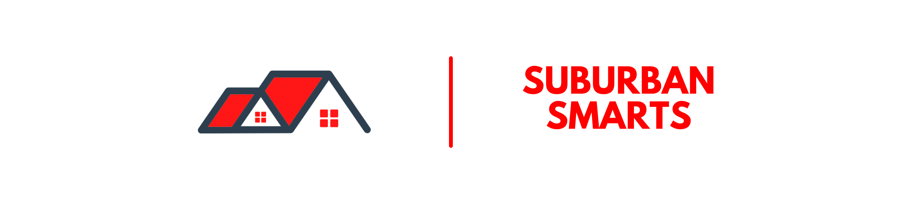

  

<h1 align="center">Suburban Smarts  Smart Home Configuration</h1>
<h3 align="center">Home Assistant Configuration &amp; Documentation for my Smart Home.</h3>

  I live in , and therefore my links are for where I purchased from. There may be better (and most likely cheaper) sites in your local regions.

Be sure to ⭐, 👀, and 🍴 my repo. Thanks!
 

  
  
  
  
  
  
  
  
  
    
  </a>
  
  
  
  </img>
  
  

This project has moved over to my documentation site, https://docs.suburbansmarts.org. Check them out for more information.

For general updates, you can check out the Suburban Smarts blog, https://suburbansmarts.org, and more stuff at https://links.suburbansmarts.org/.