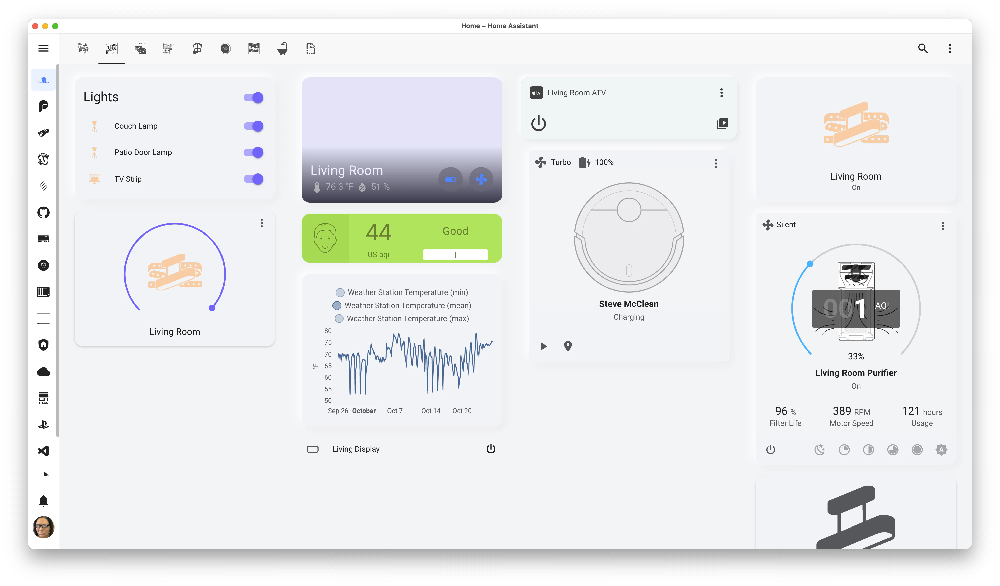
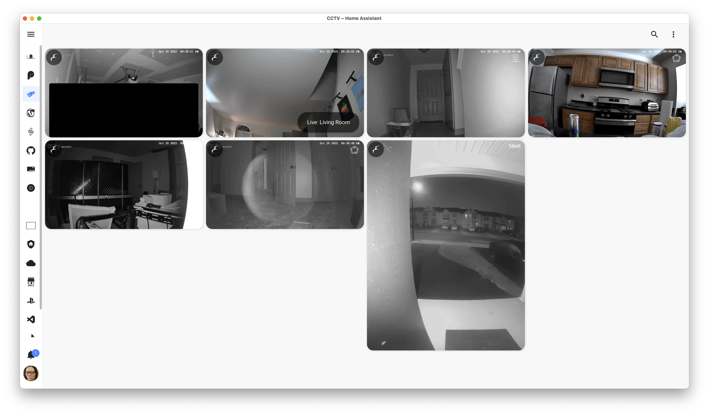
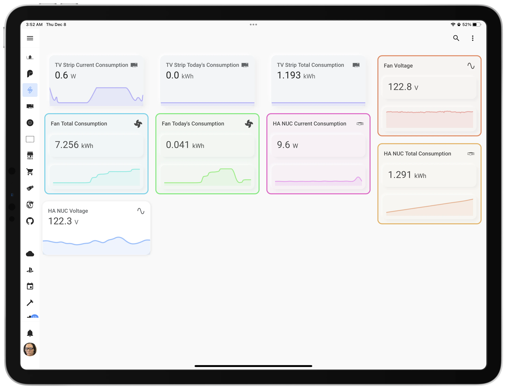
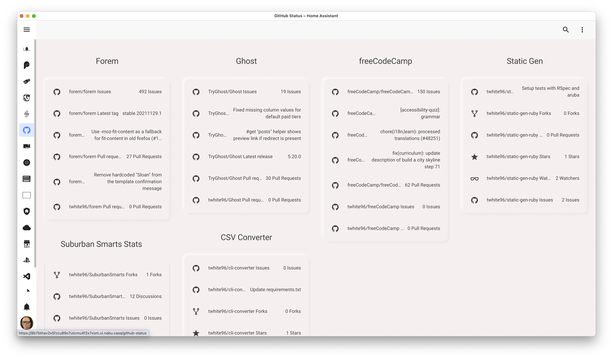
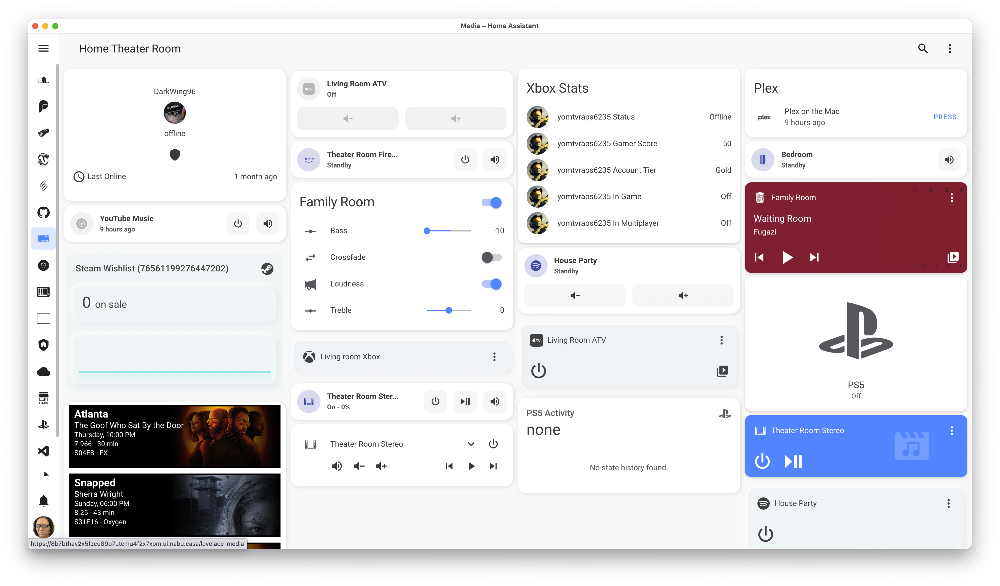
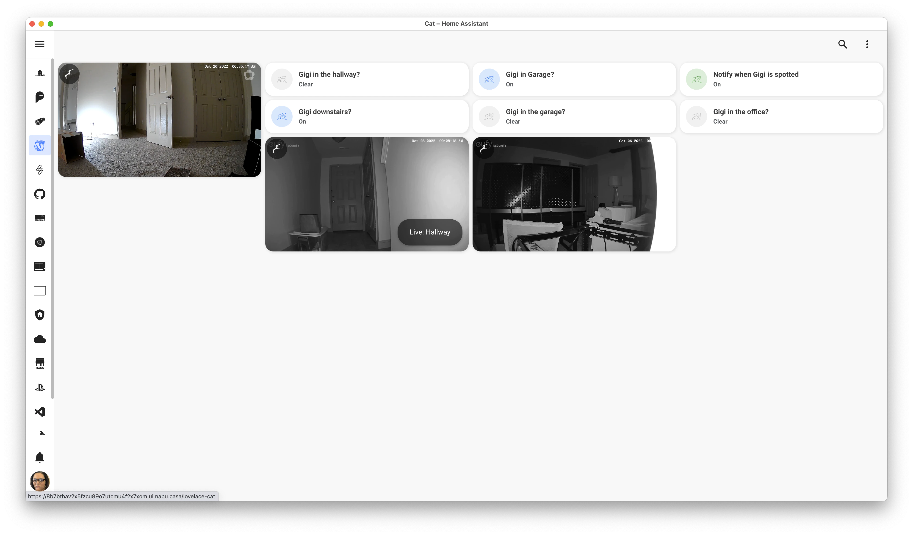
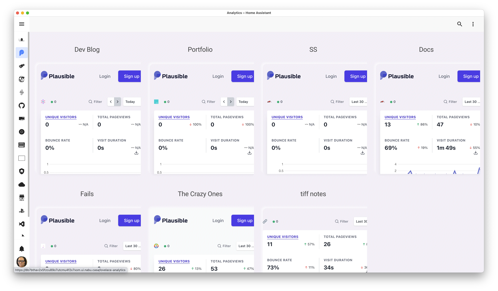
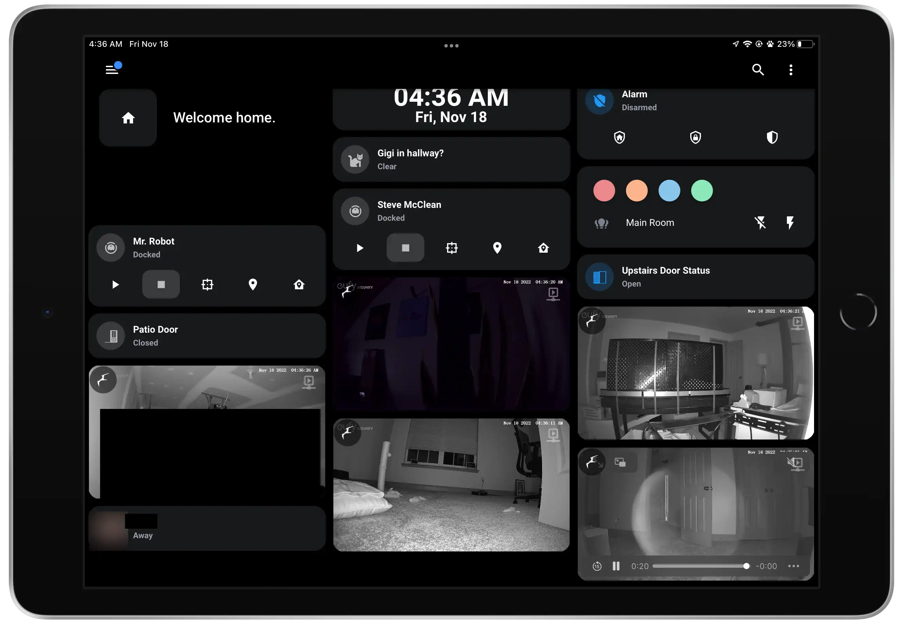

These are my current screens with some details about each.

**UPDATE**

As you know, Home Assistant is a *rabbit hole*, a *time sink*. So I've added more components which means I need to update the screens.

=== "Home"

    {: loading=lazy }
    The Living room part of my Home dashboard.

=== "CCTV"

    {: loading=lazy }
    I'd been using MotionEye for quite a while but the frame rate was really poor. I was using a Raspberry Pi 4 with an SD card then, but even when I switch to my NUC the frame rates were below 1 fps, steadily, on all cameras, all pluged in and on WiFi 6 mesh hardware. I decided that, with the new hardware, I'd use Frigate for object detection and streaming video. 

    I am still setting up object detection, as that is going to take a little fiddling.

=== "System Stats"

    {: loading=lazy }
    Random stats about my Home Assistant instance and automations. I soon plan on setting up InfluxDB, Glances, and Grafana but that is for another time.

=== "GitHub Stats"

    {: loading=lazy }
    This dashboard is just a way for me to keep track on my personal projects and projects I either want to or have contributed to.

=== "Media"

    {: loading=lazy }
    My second pride and joy, my home theater room dashboard. Still working on it, but it has all my gaming, TV, and music related interests on it.

    I am working on setting up <a href="https://github.com/hassio-addons/addon-tautulli/blob/main/README.md">Tautulli</a> for managing my Plex server. I am also thinking about migrating the server to dedicated hardware and not on my Mac Mini.

=== "Cat Watch"

    {: loading=lazy }
    The old girl loves to explore but there is no way for her to safely hide when someone comes in. I use this to let me know where she is at all times. I love that middle-aged cat and am hoping to ride off into the sunset with her. I don't want her to get out as she's skittish and would never make it.

=== "Energy Usage"

    {: loading=lazy }
    Seeing as I am only a renter of this townhouse, I can't really put any devices on the meter to monitor my energy usage but what I <em>can</em> do is use smart plugs and devices that natively monitor energy usage.

=== "Analytics"

    {: loading=lazy }
    I use <a href="https://plausible.io">Plausible Analytics</a> on all my websites instead of Google Analytics. You pay a nominal yearly fee for it, and you can host all your websites on the platform. The dashboard is simple and that's really all I need for such small sites.

=== "Wall Kiosk"

    {: loading=lazy }
    This kiosk is in progress, but I'm going to mount it in the hallway so that when I walk in, I can monitor the cameras throughout the house and disarm the alarm. When I leave I can also start/stop a vacuum session as well. 
