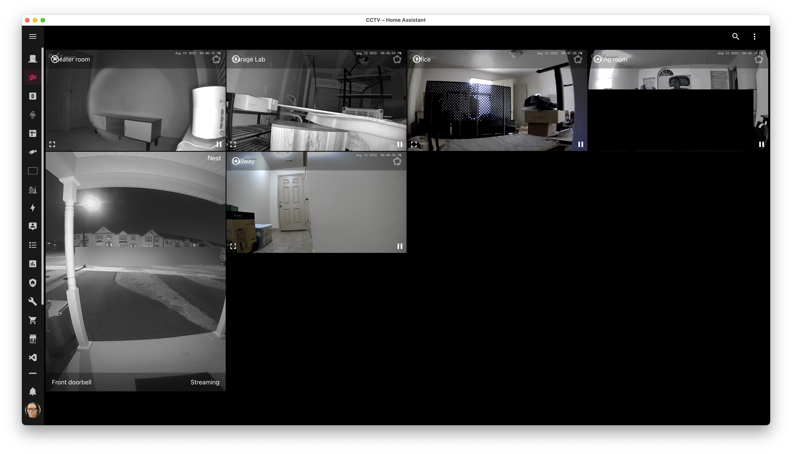
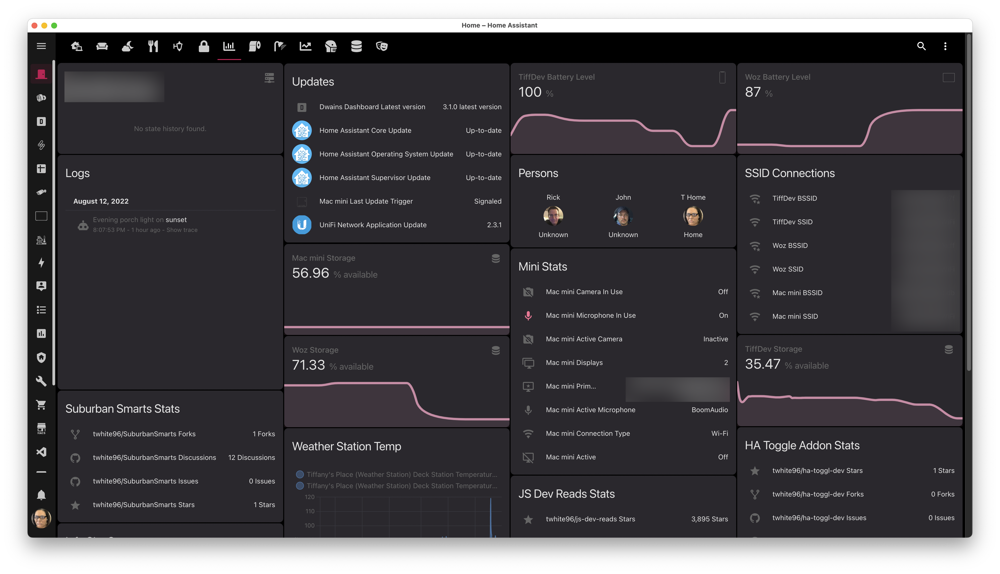
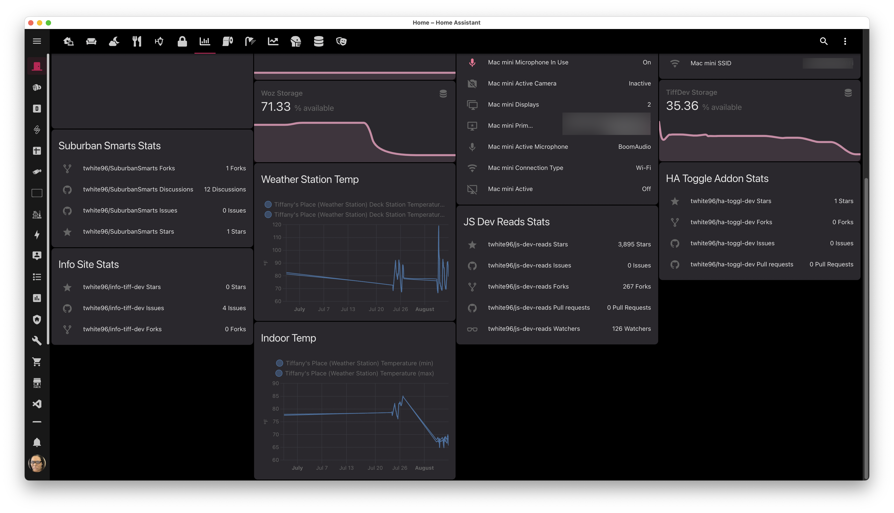

These are my current screens with some details about each.

**UPDATE**

As you know, Home Assistant is a *rabbit hole*, a *time sink*. So I've added more components which means I need to update the screens.

### Security

{: loading=lazy }

{: loading=lazy }

### System Status

{: loading=lazy }
{: loading=lazy }
