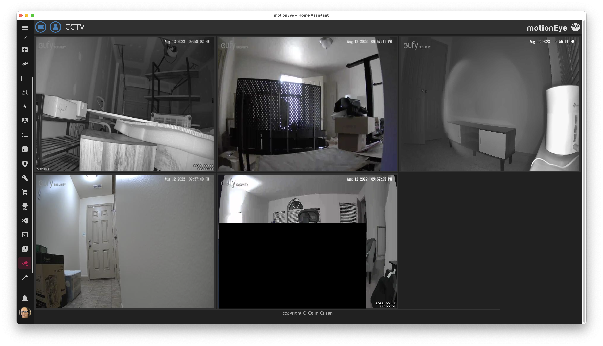
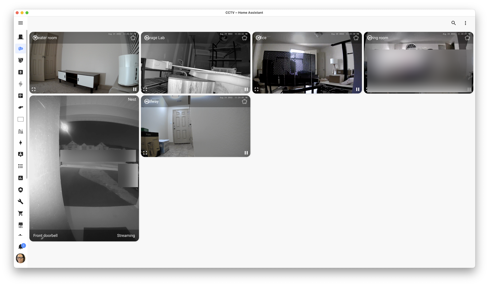
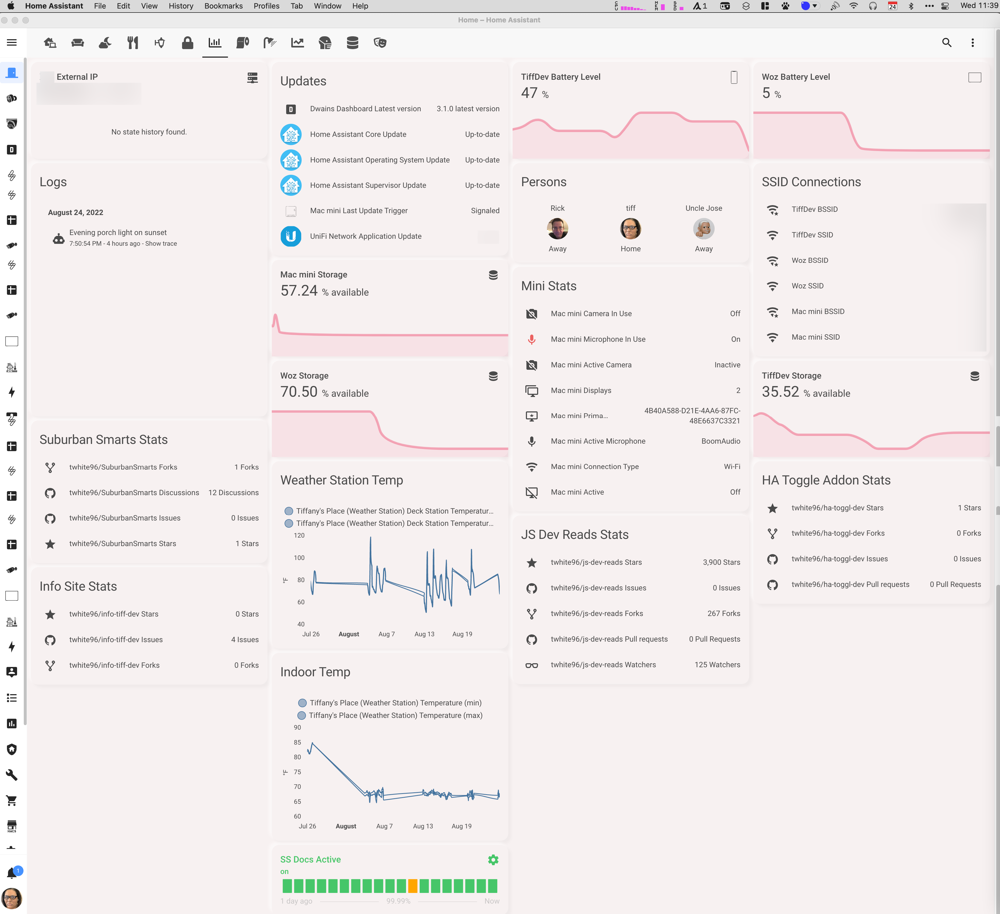
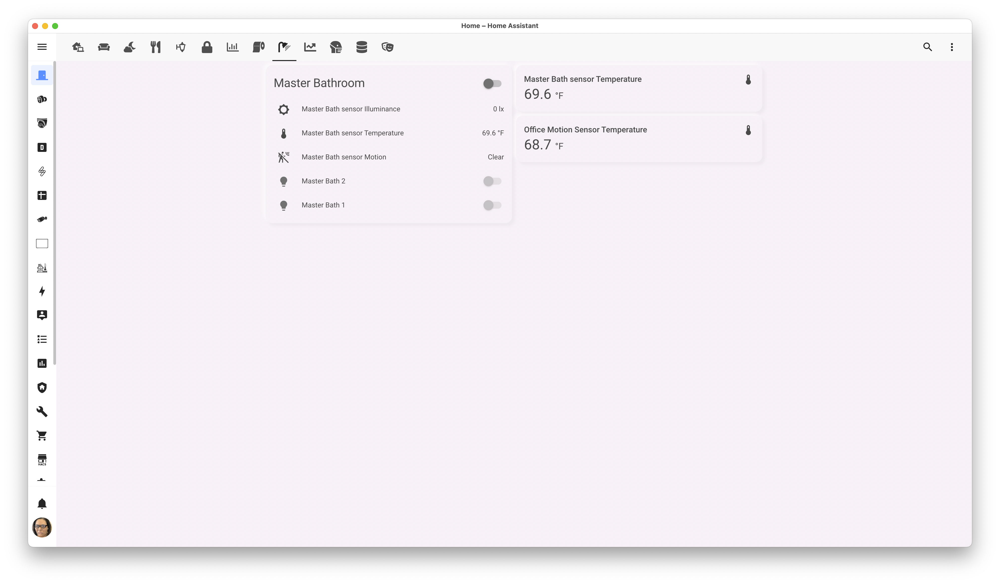
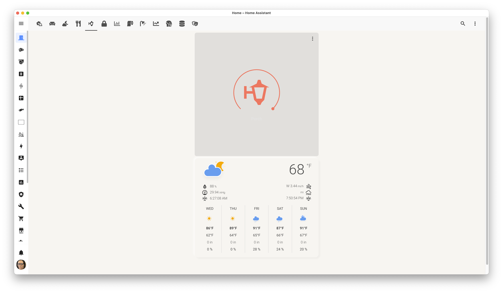
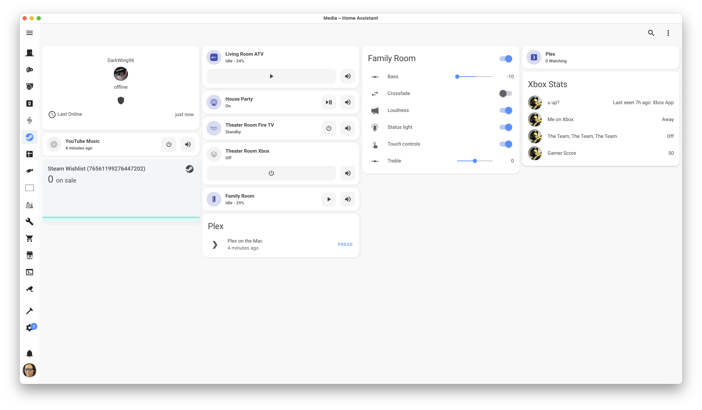

These are my current screens with some details about each.

**UPDATE**

As you know, Home Assistant is a *rabbit hole*, a *time sink*. So I've added more components which means I need to update the screens.

### Security

{: loading=lazy }
*MotionEye for CCTV*

{: loading=lazy }
*Live cams from eufy*
### System Status

{: loading=lazy }
<!-- {: loading=lazy } -->

### Master Bath
{: loading=lazy }

### Porch
{: loading=lazy }

### Media
{: loading=lazy }