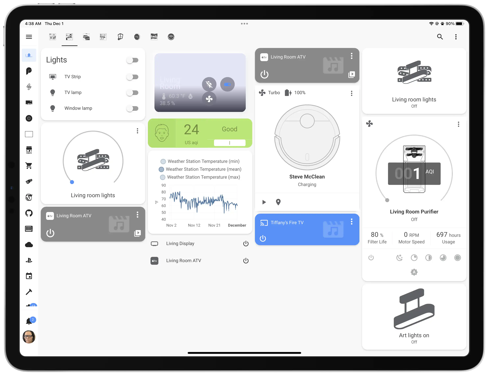
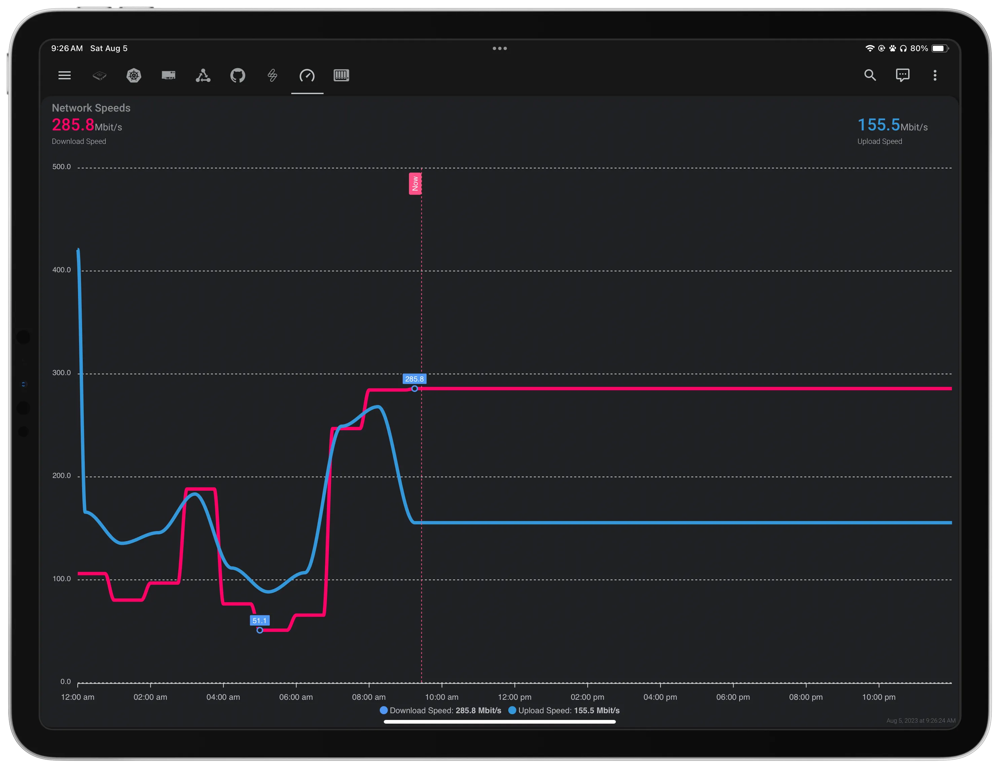
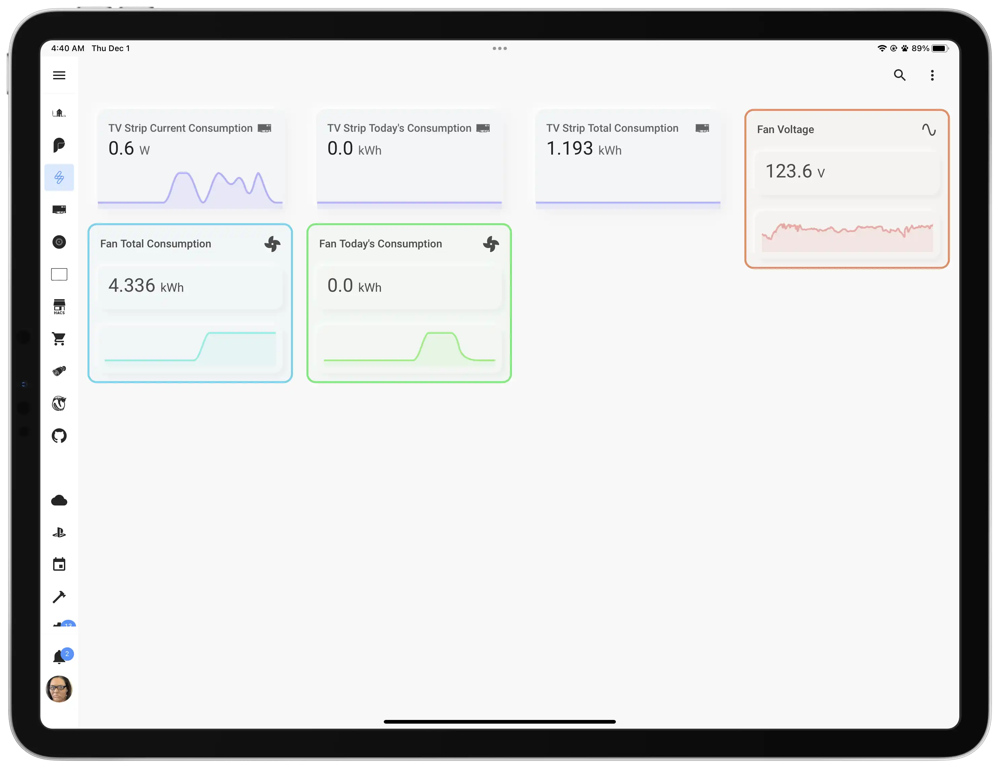
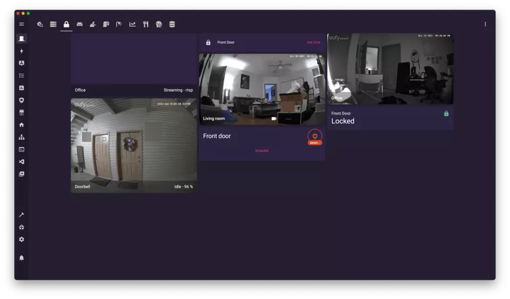

---
hide:
  - navigation
disqus: "overrides/partials/disqus.html"
---

<!-- <h3 align="center">Home Assistant Configuration &amp; Documentation for my Smart Home.</h3> -->
<!-- 

  I live in , and therefore my links are for where I purchased from. There may be better (and most likely cheaper) sites in your local regions.

Be sure to ⭐ my repo!
  -->

<a rel="me" style="display:none;" href="https://fosstodon.org/@tiff">Mastodon</a>

  

<h1 align="center">Welcome to my Smart Home!</h1>

=== "Main Room"

    {: loading=lazy }

=== "Monitoring"

    {: loading=lazy }
    
    {: loading=lazy }

=== "Energy"

    {: loading=lazy }

=== "Home Network Topology"

    {: loading=lazy }
    
<strong>You can find a larger picture of this diagram at <a href="images/diagram.png">at this link</a>. You can also get the XML file <a href="images/SuburbanSmarts.drawio.xml" download="suburban-smarts-diagram">over here.</a></strong>

<!-- === "Home Alarm System"

    {: loading=lazy }
     -->

<!-- prettier-ignore -->
!!!danger "Beware of changes"
    I constantly improve my home. It evolves as I add new devices and services. It's changing as my daily routines are changing.

    Please, keep in mind **this documentation might be outdated** in covering some details. However, I'll try my best to keep this updated.

## All the badges

  
  
  
  
  
  
  
  
  
  
  
  

## Lost and don't know where to start?

The best way to discover new ideas and inspire is by [reading the code][github-url], copying-pasting parts of my configuration and adjusting it to your needs.

Read this documentation to see the bigger picture:

[Hardware](./hardware){: .md-button }
[Software](./software/system){: .md-button }
[Home Assistant](./HomeAssistant/introduction){: .md-button }
[Resources](./resources){: .md-button }
[Topology](./topology){: .md-button}

## Motivation

I write this documentation for two main reasons:

1. **To keep track of growing my smart home.** To maintain an understanding of how things are working.
2. **To help other enthusiasts inspire.** People often ask about my smart home setup. Now I can give them a link to this documentation, instead of explaining everything once again.

## Limitations

I'm renting my townhouse. My landlord handles fixing stuff in my home, covering all the expenses. The only downside is that I can only change certain things in my home such as lighting, CCTV, and garage door automations. YMMV.

## Future Plans

I have a [public Notion board][notion] with ideas and tasks for my smart home. You can follow and comment my plans there.

[See future plans][notion]{: .md-button }

<!-- References -->

[notion]: https://tifflabs.notion.site/tifflabs/3463e6e8136c448da09cfff4ef00c553?v=f4207e2f0822443abd4fd0d9f033db35
[github-url]: https://github.com/twhite96/SuburbanSmarts
[denys-docs-url]: https://denysdovhan.com/smart-home
[macburys-docs]: https://macbury.github.io/SmartHouse/

