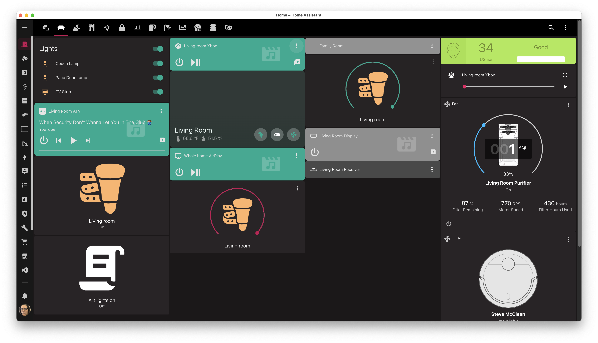
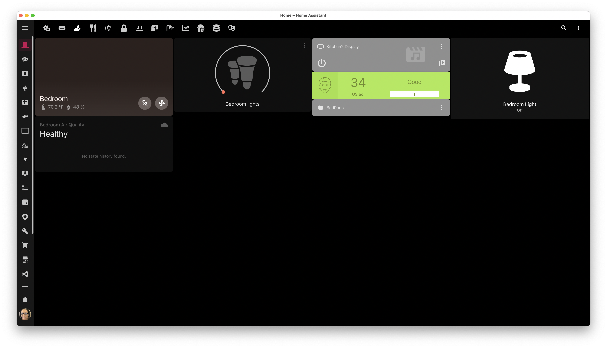
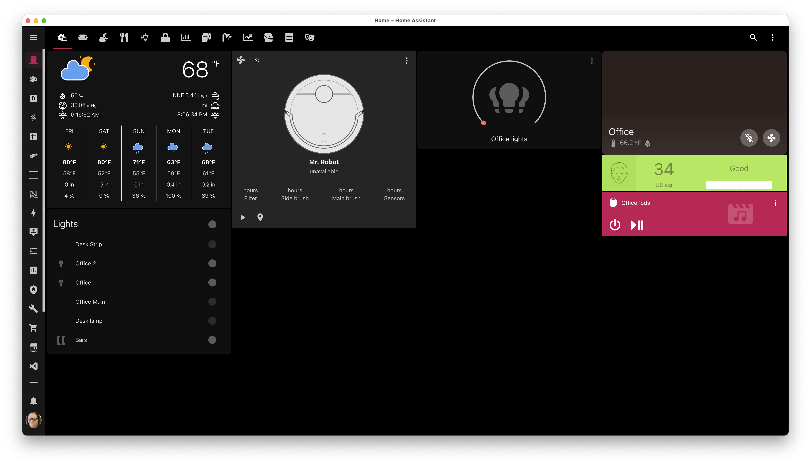

---
hide:
  - navigation
disqus: "overrides/partials/disqus.html"
---

<!-- <h3 align="center">Home Assistant Configuration &amp; Documentation for my Smart Home.</h3> -->
<!-- 

  I live in , and therefore my links are for where I purchased from. There may be better (and most likely cheaper) sites in your local regions.

Be sure to ⭐ my repo!
  -->

  

<h1 align="center">Welcome to my Smart Home!</h1>

=== "Living Room"

    {: loading=lazy }

=== "Bedroom"

    {: loading=lazy }

=== "Kitchen"

    {: loading=lazy }

=== "Office"

    {: loading=lazy }

=== "Home Network Topology"

    {: loading=lazy }
    
<strong>You can find a larger picture of this diagram at <a href="images/diagram.png">at this link</a>. You can also get the XML file <a href="images/SuburbanSmarts.drawio.xml" download="suburban-smarts-diagram">over here.</a></strong>

=== "Home Alarm System"

    {: loading=lazy }
    

<!-- prettier-ignore -->
!!!danger "Beware of changes"
    I constantly improve my home. It evolves as I add new devices and services. It's changing as my daily routines are changing.

    Please, keep in mind **this documentation might be outdated** in covering some details. However, I'll try my best to keep this updated.

## All the badges

  
  
  
  
  
  
  
  
  

  
  
  </img>
  

## Lost and don't know where to start?

The best way to discover new ideas and inspire is by [reading the code][github-url], copying-pasting parts of my configuration and adjusting it to your needs.

I've also curated a list of [my favorite Home Assistant configs][favorite-homeassistant-configs] on GitHub for extra inspiration.

Read this documentation to see the bigger picture:

[Hardware](./hardware){: .md-button }
[Software](./software/system){: .md-button }
[Home Assistant](./HomeAssistant/introduction){: .md-button }
[Resources](./resources){: .md-button }
[Topology](./topology){: .md-button}

## Motivation

I write this documentation for two main reasons:

1. **To keep track of growing my smart home.** To maintain an understanding of how things are working.
2. **To help other enthusiasts inspire.** People often ask about my smart home setup. Now I can give them a link to this documentation, instead of explaining everything once again.

## Limitations

I'm renting my apartment. My landlord handles fixing stuff in my home, covering all the expenses. The only downside is that I can't change anything in my home.

I can't disassemble anything and use custom switches or sockets. It means I can change only easily accessible parts, like bulbs.

## Future Plans

I have a [public Notion board][notion-board] with ideas and tasks for my smart home. You can follow and comment my plans there.

[See future plans][notion-board]{: .md-button }

<!-- References -->

[notion-board]: https://www.notion.so/tiffanywhite/01507ea26b0a433d8f6c010e07a9eede?v=59ac97c69a7a41d1b82bc3a08fa9a1dd
[github-url]: https://github.com/twhite96/SuburbanSmarts
[denys-docs-url]: https://denysdovhan.com/smart-home
[macburys-docs]: https://macbury.github.io/SmartHouse/
[favorite-homeassistant-configs]: https://github.com/stars/twhite96/lists/home-assistant-configs

